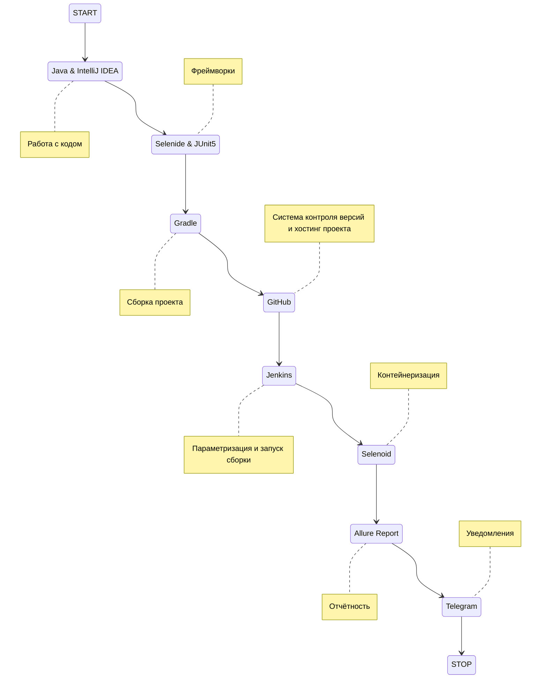
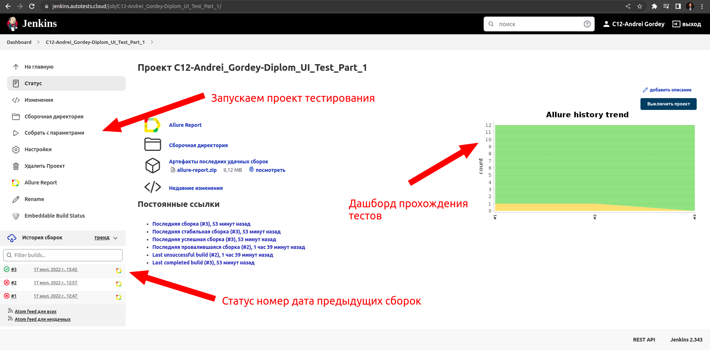
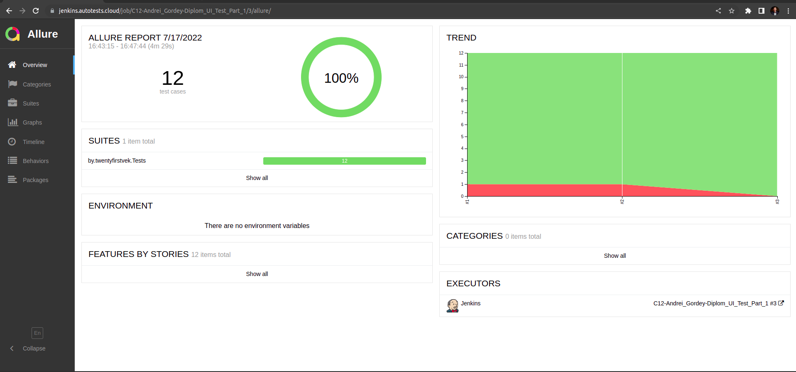
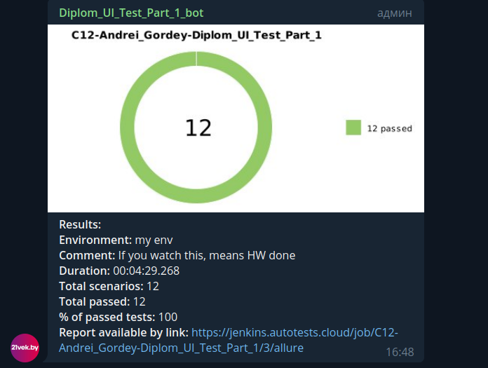
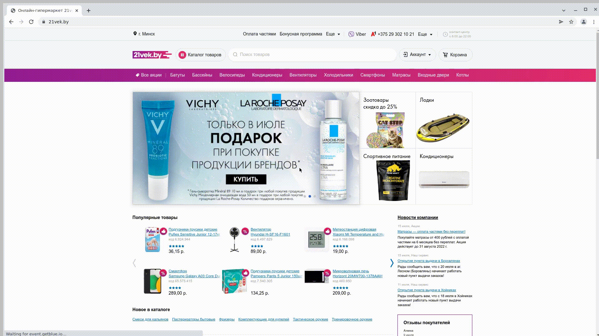

# Проект по автоматизации тестирования в рамках UI части дипломного проекта онлайн-гипермаркета 21vek.by 
## :arrow_right: <a target="_blank" href="https://www.21vek.by/">Онлайн-гипермаркет 21vek.by</a> :arrow_left:
## <a target="_blank" href="https://jenkins.autotests.cloud/job/C12-Andrei_Gordey-Diplom_UI_Test_Part_1/">Сборка в Jenkins</a>

## :floppy_disk: Содержание:

- <a href="#computer-технологии-и-инструменты">Технологии и инструменты</a>
- <a href="#notebook_with_decorative_cover-реализованные-проверки">Реализованные проверки</a>
- <a href="#electric_plug-сборка-в-Jenkins">Сборка в Jenkins</a>
- <a href="#arrow_forward-запуск-из-терминала">Запуск из терминала</a>
- <a href="#open_book-allure-отчет">Allure отчет</a>
- <a href="#hammer-allure-test-ops-отчет">Allure Test Ops отчет</a>
- <a href="#robot-отчет-в-telegram">Отчет в Telegram</a>
- <a href="#film_projector-видео-примеры-прохождения-тестов">Видео с примером прохождения теста авторизации</a>

## :computer: Технологии и инструменты
<p align="center">


</p>



## :notebook_with_decorative_cover: Реализованные проверки
- Проверка успешной авторизации
- Проверка авторизации с невалидными данными
- Проверка обязательности заполнения полей Email, password в форме авторизации
- Проверка возможности редактирования пароля в поле password в форме авторизации
- Проверка формы "Забыли пароль" в форме авторизации
- Проверка формы "Регистрация" в форме авторизации
- Проверка наличия пунктов хедера 
- Проверка наличия пунктов футера
- Переход в раздел Газонокосилок
- Проверка работы поиска
- Добавление товаров в корзину из результатов поиска


## :electric_plug: Сборка в Jenkins
### <a target="_blank" href="https://jenkins.autotests.cloud/job/C12-Andrei_Gordey-lesson13-21Vek.byTesting/">Сборка в Jenkins</a>
<p align="center">

</p>  

## :arrow_forward: Запуск из терминала
Локальный запуск:
```
gradle clean test
```

Удаленный запуск:
```
clean
test
-Dbrowser_size=${BROWSER_SIZE}
-Dbase_url=${BASE_URL}
-Dserver_selenoid=${SERVER_SELENOID}
```
## :hammer: Запуск сборки с параметрами в Jenkins
<p align="center">

</p>

## :open_book: Allure отчет
- ### Главный экран отчета
<p align="center">

</p>

- ### Страница с проведенными тестами
<p align="center">

</p>

## :robot: Отчет в Telegram
<p align="center">

</p>

## :film_projector: Видео примеры прохождения тестов
> К каждому тесту в отчете прилагается видео. Как пример, видео проверки авторизации.
<p align="center">
  
</p>